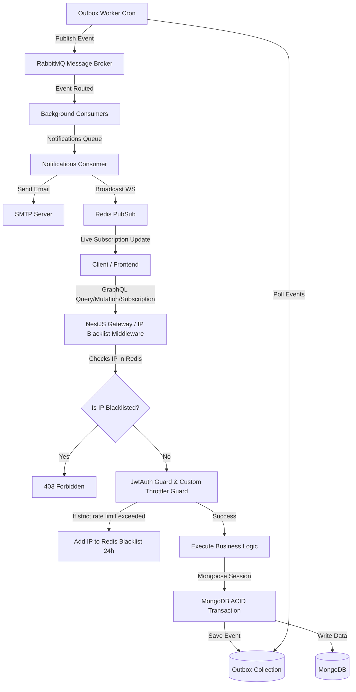
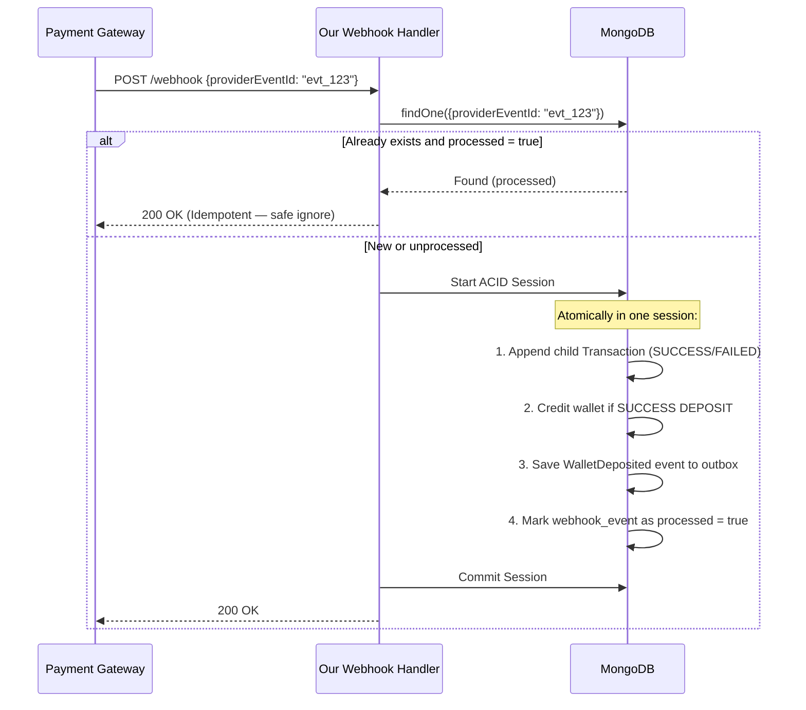
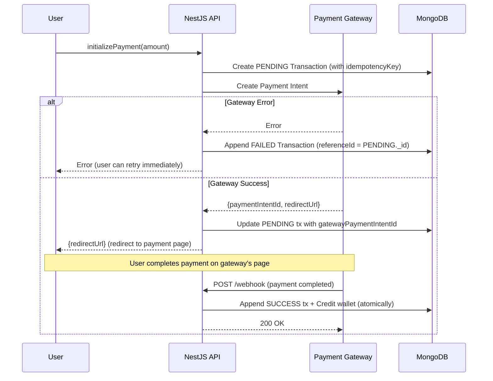

# 🔨 Mazadak - Real-Time Auction Platform

<div align="center">


**A highly scalable, robust, and event-driven backend system for a real-time auction and bidding platform. Built from the ground up using NestJS, GraphQL, and enterprise-grade Microservices patterns.**

[💻 Quick Start & Installation](#-quick-start--installation) • [🎯 Overview](#-overview) • [🏗️ Architecture Flow](#️-architecture-flow) • [🗄️ Database Entities](#️-database-entities) • [✨ Key Technical Features](#-key-technical-features) • [💳 Payment Integration](#-payment-gateway-integration)

</div>

---

## 💻 Quick Start & Installation

To get a local copy up and running, follow these simple steps.

### Prerequisites
Make sure you have the following installed on your machine:
- Node.js (v18+)
- Docker & Docker Compose (for running MongoDB, Redis, and RabbitMQ easily)

### 1. Clone the Repository
```bash
git clone https://github.com/adhamdr1/mazadak-backend.git
cd mazadak-backend
```

### 2. Install Dependencies
```bash
npm install
```

### 3. Environment Setup
We have provided an `.env.example` file. Copy it to create your own `.env` file:
```bash
cp .env.example .env
```
Open the `.env` file and fill in your Cloudinary and SMTP credentials if you plan to test image uploads and emails.

### 4. Start Infrastructure (Docker)
We use Docker to easily spin up MongoDB (with Replica Sets for Transactions), Redis, and RabbitMQ.
```bash
docker-compose up -d
```
*(Ensure Docker is running on your machine before executing this command)*

### 5. Run the Application
```bash
# Development mode
npm run start:dev

# Production build
npm run build
npm run start:prod
```

### 6. Access the API
The GraphQL Playground is available at:
👉 **http://localhost:3000/graphql**

---

## 🎯 Overview

**Mazadak** is an enterprise-grade backend infrastructure designed for high-concurrency auction environments. Users can browse items, place real-time bids, and manage their digital wallets. 

The system prioritizes **Data Consistency** and **Fault Tolerance** by relying heavily on the **Outbox Pattern**, **Event-Driven Messaging**, and **Distributed Transactions**.

---

## 🏗️ Architecture Flow

We moved away from a traditional monolithic REST API to a scalable, distributed architecture. Below is the request and lifecycle diagram for our platform:



---

## 🗄️ Database Entities

Our database schema is designed to handle financial transactions securely and maintain complete data integrity.

1. **User (`users`)**:
   - Manages authentication and authorization.
   - Contains `role` (ADMIN or USER), `isBanned` flags, and linked `googleId` for OAuth.
2. **Wallet (`wallets`)**:
   - One-to-one relationship with `User`.
   - Tracks `balance` (Total available funds) and `heldBalance` (Funds locked in active bids).
3. **Auction (`auctions`)**:
   - The core entity containing item details, `startingPrice`, `minimumBidIncrement`, and the dynamic `currentPrice`.
   - Tracks the auction `status` (ACTIVE, PENDING, COMPLETED, CANCELLED).
4. **Bid (`bids`)**:
   - Records every bid placed on an auction.
   - Tracks whether a bid is currently `WINNING` or has been `OUTBID`.
5. **Transaction (`transactions`)**:
   - The immutable financial ledger.
   - Records every `DEPOSIT`, `WITHDRAW`, `HOLD`, `RELEASE`, and `CAPTURE` operation tied to a Wallet.
6. **Outbox Event (`outbox_events`)**:
   - Temporarily stores domain events before they are picked up and published to RabbitMQ to ensure zero data loss.

---

## ✨ Key Technical Features

### 🔐 Security & Automated Threat Prevention
- **Smart Rate Limiting (`CustomThrottlerGuard`):** Enforces rate limiting per User ID if authenticated, falling back to IP address. Sensitive endpoints use a strict policy.
- **Automated IP Blacklisting:** If strict rate limits (e.g. login/banning endpoints) are breached, the malicious IP is automatically blacklisted in Redis for 24 hours.
- **Fast Gateway Filtering (`IpBlacklistMiddleware`):** Rejects requests from blacklisted IPs at the gateway level before hitting NestJS routing, saving system resources.
- **Exception Shielding:** Clean, specialized errors like `AccountBannedException` and `CannotBanAdminException` returning consistent GraphQL error structures.

### 💰 Reliable Financial Engine (ACID)
- **Non-blocking Bid Holds:** Placing a bid locks the bid amount in the user's `heldBalance` without deducting it immediately, maintaining maximum available balance visibility.
- **Instant Releases:** If outbid, the system automatically frees the held funds instantly.
- **Atomic Captures:** Upon auction completion, funds are captured from the winner and transferred to the seller via multi-document MongoDB transactions ensuring absolute consistency.

---

## 💳 Payment Gateway Integration

This is the most complex and technically demanding feature in the entire system. We built a **production-grade, fault-tolerant payment engine** from scratch, implementing multiple enterprise design patterns to guarantee absolute financial consistency — even under network failures, provider retries, or system crashes.

### The Challenge

Integrating a payment gateway is deceptively complex. The core problem is that **two separate systems** (our DB and the payment provider) must stay in sync. What happens if:
- The payment provider charges the user, but our server crashes before saving the transaction?
- The provider retries a webhook that we already processed?
- A `PENDING` transaction is stuck because the webhook was never delivered?

Each of these scenarios, if unhandled, leads to **real financial loss or data corruption**.

### Our Solution: A Multi-Layer Financial Engine

#### Layer 1 — Append-Only Ledger (Event Sourcing)

Instead of updating a single transaction record (e.g., changing `PENDING` → `SUCCESS`), we **append a new immutable child record** that references the original via `referenceId`.

```
[PENDING] ← root record (created at initiation)
    └── [SUCCESS] referenceId = PENDING._id  ← appended on success
         or
    └── [FAILED]  referenceId = PENDING._id  ← appended on failure
```

This means:
- The ledger is **tamper-proof** and **append-only** — no record is ever mutated.
- A full financial audit trail exists for every single operation.
- The `hasChild` flag on the parent record tells us whether this transaction has been settled, without an expensive DB lookup.

#### Layer 2 — Idempotent Webhook Processing

Payment providers retry webhooks aggressively (sometimes 10+ times). Without idempotency, a user could be credited multiple times for one payment.

We use a dedicated **`webhook_events` collection** as an idempotency store:



#### Layer 3 — ACID Distributed Transactions (MongoDB Sessions)

Every financial operation that involves multiple documents is wrapped in a **single MongoDB `ClientSession`**. This guarantees atomicity:

> ✅ Either ALL of these succeed together, or NONE of them are saved.

1. Append new `Transaction` record (child record with SUCCESS/FAILED status)
2. Credit/Debit the user's `Wallet`
3. Save the domain event to `outbox_events`
4. Mark the `webhook_event` as processed

If any single step throws an error, `session.abortTransaction()` rolls back the entire DB state — no partial writes, no ghost records.

#### Layer 4 — Safety Net: Reconciliation & Expiration Workers

Webhooks can fail to deliver entirely. We have two background Cron Jobs that act as a safety net:

| Worker | Job | Interval |
|---|---|---|
| `PaymentExpirationWorker` | Finds `PENDING` transactions past their `expiresAt` date and marks them `EXPIRED` | Every hour |
| `ReconciliationWorker` | Queries the payment provider's API directly to check the true status of unresolved `PENDING` transactions and reconciles them | Every hour |

This ensures **zero transactions are left stuck in `PENDING` forever**, even if every webhook was lost.

#### Layer 5 — Provider Factory Pattern (Strategy)

The integration is built with extensibility in mind. Payment provider logic is abstracted behind an `IPaymentProvider` interface, and the correct provider is resolved at runtime via a `PaymentProviderFactory`:

```
PaymentService → PaymentProviderFactory.getProvider("PAYMOB")
                                           ↓
                              IPaymentProvider (interface)
                                           ↓
                          PaymobProvider implements IPaymentProvider
```

Adding a new gateway (Stripe, PayPal, etc.) requires **zero changes to core business logic** — just implement the interface and register the provider.

### Data Flow: Initiating a Deposit



### 📧 Scalable Event-Driven Notifications
- **Outbox Pattern Worker:** Prevents data loss during network hiccups by committing notification events to the DB first. A background job polls and publishes them to RabbitMQ.
- **Asynchronous Processing:** Heavy tasks like rendering Handlebars HTML templates and sending emails (Auction won, deposit receipt, password reset) are offloaded to asynchronous background consumers.

### ⚡ Real-Time GraphQL Subscriptions
- **GraphQL-WS Handshake Validation:** Secures WebSocket connections by verifying JWT and lookup user state (active, banned, deleted) during handshake, rejecting invalid sockets.
- **Real-Time Bids & Updates:** Live bidding and notifications are pushed instantly to clients using GraphQL Subscriptions backed by **Redis Pub/Sub** for cross-instance scaling.

### ☁️ Cloud Media Integration
- **Cloudinary Integration:** Scalable image hosting and optimization for auction items.

### 🛠️ Enterprise Logging & Observability (APM)
- **Unified Winston Logger:** Exposes a unified Winston logger configuration. Prints color-coded logs locally, and outputs structured, indexable JSON logs to file-rotation drives (`logs/combined.log` and `logs/error.log`) in production, with Docker `stdout` integration.
- **Correlation & Request ID Tracking (`RequestContextMiddleware`):** Generates a unique Request/Correlation ID for every request using `AsyncLocalStorage`. All logs automatically inherit this ID to trace complete request lifecycles.
- **Auto Data Masking:** Automatically redacts sensitive fields (like `password`, `token`, `secret`, `otp`, `cardNumber`) from logs and query variables.
- **Advanced Sentry Exception Filter:** Catches and forwards unhandled server exceptions (5xx) with request tags, while filtering out benign business/user exceptions (4xx) to keep Sentry dashboard clean.
- **Global Requests Profiling (`LoggingInterceptor`):** Automatically profiles and logs path/resolver, status, execution duration (ms), and request ID for all REST and GraphQL requests.

---

## 🤝 Contributing
Contributions are always welcome! Please follow these steps:
1. Fork the repository.
2. Create a new branch (`git checkout -b feature/amazing-feature`).
3. Commit your changes (`git commit -m 'Add amazing feature'`).
4. Push to the branch (`git push origin feature/amazing-feature`).
5. Open a Pull Request.

## 👨‍💻 Author
**Adham Mohamed**
- GitHub: [@adhamdr1](https://github.com/adhamdr1)
- LinkedIn: [Adham Mohamed](https://www.linkedin.com/in/adham-mohamed74/)

---
<div align="center">
⭐ Star this repository if you find it helpful!
</div>
