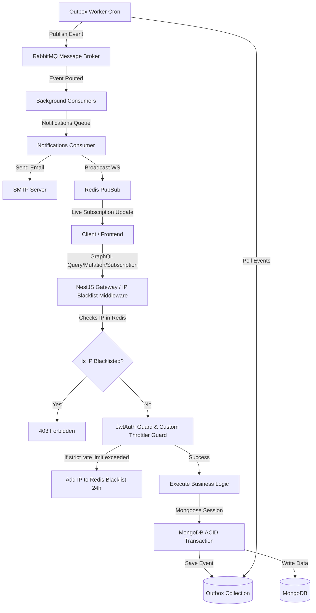

# 🔨 Mazadak - Real-Time Auction Platform

<div align="center">


**A highly scalable, robust, and event-driven backend system for a real-time auction and bidding platform. Built from the ground up using NestJS, GraphQL, and enterprise-grade Microservices patterns.**

[💻 Quick Start & Installation](#-quick-start--installation) • [🎯 Overview](#-overview) • [🏗️ Architecture Flow](#️-architecture-flow) • [🗄️ Database Entities](#️-database-entities) • [✨ Key Technical Features](#-key-technical-features) • [💳 Payment Integration](#-payment-gateway-integration) • [🔨 Real-Time Bidding](#-real-time-bidding-flow) • [🤖 Auto-Bidding Engine](#-auto-bidding-proxy-bidding-engine) • [💬 Real-Time Chat Engine](#-post-auction-real-time-chat-engine) • [⭐ Rating & Reviews](#-rating--reviews-system)

</div>

---

## 💻 Quick Start & Installation

To get a local copy up and running, follow these simple steps.

### Prerequisites

Make sure you have the following installed on your machine:

- Node.js (v18+)
- Docker & Docker Compose (for running MongoDB, Redis, and RabbitMQ easily)

### 1. Clone the Repository

```bash
git clone https://github.com/adhamdr1/mazadak-backend.git
cd mazadak-backend
```

### 2. Install Dependencies

```bash
npm install
```

### 3. Environment Setup

We have provided an `.env.example` file. Copy it to create your own `.env` file:

```bash
cp .env.example .env
```

Open the `.env` file and fill in your Cloudinary and SMTP credentials if you plan to test image uploads and emails.

### 4. Start Infrastructure (Docker)

We use Docker to easily spin up MongoDB (with Replica Sets for Transactions), Redis, and RabbitMQ.

```bash
docker-compose up -d
```

_(Ensure Docker is running on your machine before executing this command)_

### 5. Run the Application

```bash
# Development mode
npm run start:dev

# Production build
npm run build
npm run start:prod
```

### 6. Access the API

The GraphQL Playground is available at:
👉 **http://localhost:3000/graphql**

---

## 🎯 Overview

**Mazadak** is an enterprise-grade backend infrastructure designed for high-concurrency auction environments. Users can browse items, place real-time bids, and manage their digital wallets.

The system prioritizes **Data Consistency** and **Fault Tolerance** by relying heavily on the **Outbox Pattern**, **Event-Driven Messaging**, and **Distributed Transactions**.

---

## 🏗️ Architecture Flow

We moved away from a traditional monolithic REST API to a scalable, distributed architecture. Below is the request and lifecycle diagram for our platform:



---

## 🗄️ Database Entities

Our database schema is designed to handle financial transactions securely and maintain complete data integrity.

1. **User (`users`)**:
   - Manages authentication and authorization.
   - Contains `role` (ADMIN or USER), `isBanned` flags, and linked `googleId` for OAuth.
2. **Wallet (`wallets`)**:
   - One-to-one relationship with `User`.
   - Tracks `balance` (Total available funds) and `heldBalance` (Funds locked in active bids).
3. **Auction (`auctions`)**:
   - The core entity containing item details, `startingPrice`, `minimumBidIncrement`, and the dynamic `currentPrice`.
   - Tracks the auction `status` (ACTIVE, PENDING, ENDED, CANCELLED).
4. **Bid (`bids`)**:
   - Records every bid placed on an auction.
   - Tracks whether a bid is currently `WINNING` or has been `OUTBID`.
5. **AutoBid (`auto_bids`)**:
   - Stores automated proxy bidding configurations (`auctionId`, `userId`, `maxAmount`, `status: ACTIVE | EXHAUSTED | CANCELLED`).
   - Enforces unique index `{ auctionId, userId }` and composite sorting index `{ auctionId, status, maxAmount: -1, createdAt: 1 }` for FIFO deterministic tie-breaking.
6. **Transaction (`transactions`)**:
   - The immutable financial ledger.
   - Records every `DEPOSIT`, `WITHDRAW`, `HOLD`, `RELEASE`, and `CAPTURE` operation tied to a Wallet.
7. **Chat Message (`chat_messages`)**:
   - Stores post-auction messages, clientMessageId idempotency, reactions array, media URLs, edit/delete flags, and sender snapshots.
8. **Chat Read State (`chat_read_states`)**:
   - Tracks the latest read message ID and read timestamp per participant for real-time read receipts.
9. **Webhook Event (`webhook_events`)**:
   - Dedicated store ensuring idempotent, exactly-once processing of payment gateway webhook callbacks.
10. **Outbox Event (`outbox_events`)**:
    - Temporarily stores domain events before they are picked up and published to RabbitMQ to ensure zero data loss.
11. **Review (`reviews`)**:
    - Stores ratings (1-5), multi-dimensional criteria breakdown, mutual blind review states (`PENDING`, `PUBLISHED`, `HIDDEN`), public seller replies, and published timestamps.

---

## ✨ Key Technical Features

### 🔐 Security & Automated Threat Prevention

- **Smart Rate Limiting (`CustomThrottlerGuard`):** Enforces rate limiting per User ID if authenticated, falling back to IP address. Sensitive endpoints use a strict policy. WebSocket subscriptions safely bypass HTTP headers.
- **Automated IP Blacklisting:** If strict rate limits (e.g. login/banning endpoints) are breached, the malicious IP is automatically blacklisted in Redis for 24 hours.
- **Fast Gateway Filtering (`IpBlacklistMiddleware`):** Rejects requests from blacklisted IPs at the gateway level before hitting NestJS routing, saving system resources.
- **Exception Shielding:** Clean, specialized errors like `AccountBannedException` and `CannotBanAdminException` returning consistent GraphQL error structures.

### 💰 Reliable Financial Engine (ACID)

- **Non-blocking Bid Holds:** Placing a bid locks the bid amount in the user's `heldBalance` without deducting it immediately, maintaining maximum available balance visibility.
- **Instant Releases:** If outbid, the system automatically frees the held funds instantly.
- **Atomic Captures:** Upon auction completion, funds are captured from the winner and transferred to the seller via multi-document MongoDB transactions ensuring absolute consistency.

---

## 💳 Payment Gateway Integration

This is one of the most complex and technically demanding features in the system. We built a **production-grade, fault-tolerant payment engine** from scratch, implementing multiple enterprise design patterns to guarantee absolute financial consistency — even under network failures, provider retries, or system crashes.

### Data Flow: Asynchronous Webhook Ingestion & Wallet Credit

Below is the complete event-driven lifecycle for deposit webhooks:

```mermaid
sequenceDiagram
    autonumber
    participant PG as Payment Gateway (Stripe/Paymob)
    participant Ctrl as PaymentController
    participant Svc as PaymentService
    participant DB as MongoDB
    participant Outbox as Outbox Service
    participant RMQ as RabbitMQ
    participant Consumer as WalletConsumer

    PG->>Ctrl: Webhook Event
    Ctrl->>Svc: verifySignature(signature, payload)

    rect rgb(30, 40, 50)
        Note over Svc,Outbox: MongoDB Transaction Session (Atomic Ingestion)
        Svc->>DB: Idempotency Check (webhook_events)
        Svc->>DB: Save Webhook Event (processed = false)
        Svc->>Outbox: Save PaymentWebhookReceived Event
    end

    Ctrl-->>PG: 200 OK (Safe Ingestion Acknowledged)

    Outbox->>RMQ: Outbox Worker Publishes Event
    RMQ->>Consumer: Consume PaymentWebhookReceived Event

    rect rgb(30, 40, 50)
        Note over Svc,Outbox: MongoDB Transaction Session (Settlement Validation)
        Consumer->>Svc: Process Webhook Event
        Svc->>DB: Validate Amount & Currency Match
        Svc->>DB: Append SUCCESS Transaction & Update Parent (hasChild = true)
        Svc->>Outbox: Save WalletDepositInitiated Event
    end

    Consumer-->>RMQ: ACK

    RMQ->>Consumer: Consume WalletDepositInitiated Event

    rect rgb(30, 40, 50)
        Note over Consumer,Outbox: MongoDB Transaction Session (Wallet Credit)
        Consumer->>DB: Credit User Wallet Balance (creditBalance)
        Consumer->>DB: Update Transaction (walletCredited = true)
        Consumer->>Outbox: Save WalletDeposited Event
    end

    Consumer-->>RMQ: ACK
```



### Multi-Layer Architectural Pillars

#### Layer 1 — Append-Only Ledger (Event Sourcing)

Instead of mutating a single transaction record (e.g., updating `PENDING` → `SUCCESS`), we **append an immutable child record** referencing the root record via `referenceId`:

```
[PENDING] ← root record (created at initiation)
    └── [SUCCESS] referenceId = PENDING._id  ← appended on success
         or
    └── [FAILED]  referenceId = PENDING._id  ← appended on failure
```

- Ledger is **tamper-proof** and **append-only**.
- Full financial audit trail exists for every transaction.
- The `hasChild` flag indicates settlement status without expensive DB lookups.

#### Layer 2 — Idempotent Webhook Processing

Payment providers retry webhooks aggressively. A dedicated `webhook_events` collection acts as an idempotency barrier:

- If a webhook event was already recorded as processed, it returns `200 OK` immediately without duplicate execution.

#### Layer 3 — ACID Distributed Transactions (MongoDB Sessions)

Every multi-document operation executes within a single MongoDB `ClientSession`:

> ✅ Either ALL state changes (child transaction, wallet balance, outbox events, webhook status) succeed together, or NONE are committed.

#### Layer 4 — Safety Net: Reconciliation & Expiration Workers

- **`PaymentExpirationWorker`:** Scans for stale `PENDING` transactions past their expiration threshold and expires them cleanly.
- **`ReconciliationWorker`:** Queries the payment provider's API directly to resolve stuck transactions and sync unconfirmed webhooks.

#### Layer 5 — Provider Factory Pattern (Strategy)

Payment logic is abstracted behind an `IPaymentProvider` interface resolved at runtime via `PaymentProviderFactory`:

```
PaymentService → PaymentProviderFactory.getProvider("PAYMOB")
                                           ↓
                              IPaymentProvider (interface)
                                           ↓
                          PaymobProvider implements IPaymentProvider
```

---

## 🔨 Real-Time Bidding Flow

The core bidding engine provides **zero-latency real-time price updates** while maintaining strict financial locking via the user's wallet. It natively integrates with the automated **Proxy Bidding Engine** to ensure bids placed manually trigger automated responses seamlessly.

### Manual Bidding Lifecycle:

1. **Validation & Distributed Lock:** The bidder calls `placeBid`. The system verifies the auction is `ACTIVE`, the bidder is not the seller, and the bid amount satisfies `currentPrice + minimumBidIncrement`.
2. **Financial Hold:** The bidder's wallet is checked for available funds (`balance - heldBalance`). The new bid amount is locked in `heldBalance`, while the previous winning bidder's funds are instantly released.
3. **State Mutation:** The previous winning bid is marked `OUTBID`, the new bid is created as `WINNING`, and the auction's `currentPrice` and `winnerId` are updated.
4. **Proxy Auto-Bid Trigger:** If active auto-bids exist from rival bidders, the engine automatically calculates the required counter-bid and places an automated winning bid on their behalf within the same transaction.
5. **Real-Time Broadcast & Outbox:** Emits a `bidAdded` event over **Redis Pub/Sub** for all active GraphQL WebSocket subscribers, and creates `BidPlaced` and `BidderOutbid` transactional outbox events for background email/push processing.

```mermaid
sequenceDiagram
    autonumber
    participant Bidder as Bidder / Client
    participant API as GraphQL API (BidsResolver)
    participant BidSvc as BidsService
    participant ProxySvc as ProxyEngine / AutoBid
    participant WalletSvc as WalletService
    participant DB as MongoDB
    participant Outbox as Outbox Service
    participant PubSub as Redis Pub/Sub
    participant RMQ as RabbitMQ
    participant LiveBidders as Connected Bidders (WS)

    Bidder->>API: Mutation: placeBid(auctionId, amount)
    API->>BidSvc: placeBid(userId, auctionId, amount)

    rect rgb(30, 40, 50)
        Note over BidSvc,Outbox: MongoDB ACID Transaction Session
        BidSvc->>DB: Validate Auction Status (ACTIVE) & Min Increment
        BidSvc->>WalletSvc: Hold Funds (amount - previousHold)
        WalletSvc->>DB: Lock Funds in heldBalance (Available Balance Check)
        BidSvc->>DB: Release Hold of Previous Outbidder (heldBalance freed)
        BidSvc->>DB: Create Bid (WINNING) & Mark Old as OUTBID
        BidSvc->>DB: Update Auction currentPrice & winnerId

        opt Rival Active Auto-Bids Exist
            BidSvc->>ProxySvc: calculateNextState(currentPrice, activeAutoBids)
            ProxySvc-->>BidSvc: Automated Counter-Bid (Amount = manualBid + increment)
            BidSvc->>WalletSvc: Adjust Auto-Bidder heldBalance
            BidSvc->>DB: Create Auto-Bid (WINNING) & Mark Manual Bid OUTBID
            BidSvc->>DB: Update Auction currentPrice to Counter-Bid
        end

        BidSvc->>Outbox: Save BidPlaced, AutoBidPlaced & BidderOutbid Events
    end

    BidSvc->>PubSub: Publish bidAdded Event
    PubSub-->>LiveBidders: Push Live Bid Update to all Subscribers (Real-Time ⚡)
    API-->>Bidder: Bid Successfully Placed (Bid Object)

    Outbox->>RMQ: Outbox Worker Publishes Events
    RMQ->>API: Notifications Consumer Dispatches Outbid & Auto-Bid Alerts
```



---

## 🤖 Auto-Bidding (Proxy Bidding) Engine

An enterprise-grade, algorithmically pure **Proxy Bidding Engine** that allows users to set a maximum budget ceiling (`maxAmount`). The system acts on the user's behalf, placing the minimum incremental bid necessary to maintain the winning position up to their declared ceiling.

### 🧠 Core Architectural Pillars

#### 1. Pure Deterministic Mathematical Engine (`ProxyBiddingEngineService`)

- Engineered as a **100% pure functional calculation engine** with zero side-effects or direct database dependencies.
- Given the current auction state (start price, current price, minimum increment, existing winner) and active auto-bid configurations, it deterministically computes the exact next winning state, required bid amounts, and exhausted configurations.
- Fully unit tested across single-bidder, manual counter-attacks, multi-proxy bidding wars, and edge cases.

#### 2. Distributed Mutex Concurrency Lock

- High-concurrency race conditions during simultaneous bids are prevented using Redis distributed locks:
  `auction:bid:lock:<auctionId>`
- Acquired with a strict 5-second TTL and released atomically via a custom **Lua script** (`RELEASE_LOCK_LUA_SCRIPT`) verifying lock ownership.

#### 3. Smart Non-Blocking Financial Holds

- When setting an auto-bid, the system verifies `availableBalance >= maxAmount` (`balance - heldBalance`).
- **Funds Optimization:** Instead of locking the entire `maxAmount`, the wallet only locks the _current winning bid amount_. As the auction price increases, the held balance dynamically adjusts upwards, maximizing available funds for other actions on the platform.

#### 4. Strict FIFO Tie-Breaking

- If two users submit identical maximum amounts, the engine guarantees fairness by sorting candidates by `{ maxAmount: -1, createdAt: 1 }`.
- The user who configured their auto-bid first retains priority.

#### 5. Multi-Channel Exhaustion Alerts & Dedicated Templates

- When a proxy bid reaches its ceiling and is surpassed by a rival bid, its status transitions atomically to `EXHAUSTED`.
- The system dispatches an `AutoBidExhausted` event through the Transactional Outbox, rendering a dedicated responsive HTML email template ([`auto-bid-exhausted.hbs`](file:///D:/Projects/mazadak-backend/src/notifications/email/templates/auto-bid-exhausted.hbs)) and delivering in-app notifications.

---

### 🔄 Auto-Bidding Operational Scenarios

| Scenario                     | Trigger                                              | Engine Action                                                                                    | Resulting Price & Winner                                      |
| :--------------------------- | :--------------------------------------------------- | :----------------------------------------------------------------------------------------------- | :------------------------------------------------------------ |
| **A. First Auto-Bid**        | User sets auto-bid on auction with no bids           | Engine places opening bid at `startingPrice`.                                                    | Current Price = `startingPrice`, Auto-bidder leads.           |
| **B. Manual vs Auto-Bid**    | Rival places manual bid below auto-bid max           | Engine immediately counter-bids at `manualBid + increment`.                                      | Manual bidder outbid, Auto-bidder retains lead.               |
| **C. Proxy Bidding War**     | Two auto-bids compete (`Max A: 5000`, `Max B: 3000`) | Engine resolves competition: Bidder B reaches `3000` (`EXHAUSTED`), Bidder A counters at `3100`. | Bidder A leads at `3100`, Bidder B receives exhaustion email. |
| **D. Identical Max Ceiling** | Bidder 2 attempts to set identical max as Bidder 1   | Prevented via `AutoBidDuplicateMaxException` or FIFO priority.                                   | Earlier timestamp maintains lead.                             |
| **E. Manual Cancellation**   | User calls `cancelAutoBid`                           | Auto-bid marked `CANCELLED`. Winning bid remains active until outbid.                            | Auto-bidding stops for that user.                             |

---

### 📊 Proxy Bidding Execution Flow

```mermaid
sequenceDiagram
    autonumber
    participant User as Bidder (Adham)
    participant API as GraphQL Gateway
    participant AutoSvc as AutoBiddingService
    participant Engine as ProxyBiddingEngineService
    participant Redis as Redis Lock & PubSub
    participant DB as MongoDB (ACID Session)
    participant Outbox as Outbox Collection
    participant RMQ as RabbitMQ
    participant Consumer as NotificationsConsumer

    User->>API: Mutation: setAutoBid(auctionId, maxAmount: 5000)
    API->>AutoSvc: setAutoBid(userId, input)

    AutoSvc->>Redis: SET auction:bid:lock:<auctionId> (NX EX 5)
    Note over AutoSvc,Redis: Distributed Mutex Acquired 🔒

    rect rgb(30, 40, 50)
        Note over AutoSvc,DB: MongoDB ACID Transaction Session
        AutoSvc->>DB: Validate Auction Status (ACTIVE) & Not Seller
        AutoSvc->>DB: Validate Available Wallet Balance >= maxAmount
        AutoSvc->>DB: Upsert AutoBid Config (status: ACTIVE)
        AutoSvc->>DB: Fetch All Active Auto-Bids for Auction

        AutoSvc->>Engine: calculateNextState(auctionState, activeAutoBids)
        Engine-->>AutoSvc: { winningBidderId, winningAmount, bidsToCreate, exhaustedAutoBidIds }

        loop For each exhausted AutoBid
            AutoSvc->>DB: Update AutoBid status -> EXHAUSTED
            AutoSvc->>Outbox: Save AutoBidExhausted Event
        end

        opt New Winning Bid Generated
            AutoSvc->>DB: Release Previous Outbidder Hold
            AutoSvc->>DB: Hold Funds for Winner (winningAmount)
            AutoSvc->>DB: Insert Winning Bid & Update Auction currentPrice
            AutoSvc->>Outbox: Save BidPlaced & AutoBidPlaced Events
        end
    end

    AutoSvc->>Redis: Release Distributed Mutex (Lua Script 🔓)
    AutoSvc->>Redis: Invalidate Active Auctions Cache & Publish bidAdded (WS)
    API-->>User: AutoBid Configuration (status: ACTIVE 🟢)

    Outbox->>RMQ: Outbox Worker Publishes Events
    RMQ->>Consumer: Consume AutoBidExhausted Event
    Consumer->>User: Send Exhaustion Email (auto-bid-exhausted.hbs) & In-App Notification 📬
```



---

## 💬 Post-Auction Real-Time Chat Engine

A private, secure communication channel established between the **Seller** and the **Winning Bidder** once an auction has concluded (`status = ENDED`).

### Architectural Highlights

- **Role-Based Access Control:** Restricted exclusively to the auction's seller, winning bidder, and platform admins.
- **WebSocket Subscriptions (Native `graphql-transport-ws`):** Live streaming of new messages (`messageSent`), message edits/deletions/reactions (`messageUpdated`), and read receipts (`chatReadStatusUpdated`) powered by **Redis Pub/Sub**.
- **15-Minute Edit & Delete Window:** Users can edit or delete messages within 15 minutes of sending. Deletions retain an audit trail marking `isDeleted = true`.
- **Client Message ID Idempotency:** Guaranteed once-only delivery using composite unique indices `{ auctionId, senderId, clientMessageId }`.
- **Media Albums & Reactions:** Supports up to 10 image attachments per message and instant emoji reactions.
- **Asynchronous Offline Notifications:** Dispatches notification events through RabbitMQ to alert participants via email when they are offline.

```mermaid
sequenceDiagram
    autonumber
    participant Client as Winner / Seller (Browser)
    participant WS as WebSocket Gateway (GraphQL-WS)
    participant API as GraphQL API (ChatResolver)
    participant ChatSvc as ChatService
    participant DB as MongoDB
    participant PubSub as Redis Pub/Sub
    participant RMQ as RabbitMQ
    participant Other as Other Participant (Browser)

    Client->>WS: connection_init { Authorization: Bearer JWT }
    WS->>WS: Validate JWT & User Status (Active / Not Banned)
    WS-->>Client: connection_ack (Authenticated 🟢)
    Client->>WS: subscribe: messageSent(auctionId)

    Note over Client,Other: Participant sends a new chat message

    Client->>API: Mutation: sendMessage(auctionId, clientMessageId, content, mediaUrls)
    API->>ChatSvc: sendMessage(senderId, input)
    ChatSvc->>ChatSvc: verifyChatAccess(auction.status == ENDED & user is Seller/Winner)

    rect rgb(30, 40, 50)
        Note over ChatSvc,DB: Atomic Storage & Idempotency Check
        ChatSvc->>DB: Save Message with Unique Index {auctionId, senderId, clientMessageId}
    end

    ChatSvc->>PubSub: publishMessageSent(message)
    ChatSvc->>RMQ: publishChatNotification(ChatMessageSent) [Async Offline Alert]
    API-->>Client: Message Created Successfully

    PubSub-->>WS: Broadcast to Active WebSocket Subscribers
    WS-->>Client: Live WS Event (messageSent)
    WS-->>Other: Live WS Event (messageSent - Real-Time Delivery 🚀)
```



---

## ⭐ Rating & Reviews System

An Airbnb-style, two-sided **Mutual Blind Review Engine** engineered for transaction integrity, trust building, and prevention of retaliatory ratings between buyers and sellers.

### Architectural & Business Highlights

- **Mutual Blind Review Flow:** When the first party (e.g. Winner) submits a review, its status is stored as `PENDING` and kept hidden from both public profile queries and the counterpart (Seller).
- **Simultaneous Double-Blind Reveal:** As soon as the counterpart submits their review within a multi-document MongoDB transaction, both reviews transition atomically to `PUBLISHED`, trigger Outbox events, and invalidate user Redis caches.
- **14-Day Review Window & Expiration Cron:** Participants have 14 days from auction conclusion to submit reviews. A scheduled background worker automatically transitions single orphaned pending reviews to `PUBLISHED` once the window expires.
- **Multi-Dimensional Granular Criteria:**
  - _Buyer reviewing Seller:_ Overall Rating (1-5), `itemAccuracy`, `communication`, `packaging`, and `smoothExperience`.
  - _Seller reviewing Buyer:_ Overall Rating (1-5), `communication`, and `smoothExperience`.
- **Public Single-Thread Reply:** The reviewed user can post a single public reply to any published review (e.g., expressing gratitude or addressing feedback).
- **Admin Moderation with Real-Time Score Invalidation:** Platform admins can hide abusive reviews (`status = HIDDEN`), which immediately recalculates user average star ratings, star breakdowns, and flushes Redis caches.
- **High-Performance Redis SWR Caching:** Review listings and user rating aggregates are served via **Stale-While-Revalidate** with single-flight request coalescing and automated `dateReviver` deserialization.

```mermaid
sequenceDiagram
    autonumber
    participant Buyer as Buyer (Winner)
    participant Seller as Seller
    participant API as GraphQL Gateway
    participant ReviewSvc as ReviewsService
    participant DB as MongoDB (ACID Transaction)
    participant Redis as Redis SWR Cache
    participant Outbox as Outbox Collection
    participant Worker as Expiration Cron Worker

    Note over Buyer,Seller: Phase 1: Buyer Submits First Review (Blind Mode)
    Buyer->>API: Mutation: createReview(auctionId, overallRating: 5, criteria, comment)
    API->>ReviewSvc: createReview(buyerId, input)
    ReviewSvc->>ReviewSvc: Verify Eligibility (Auction ENDED, Winner/Seller, Within 14-Day Window)
    ReviewSvc->>DB: Check Counterpart Review Exists? (None found)
    ReviewSvc->>DB: Insert Review (status: PENDING)
    ReviewSvc->>Outbox: Save ReviewCreated Event
    API-->>Buyer: Review Created (status: PENDING 🔒)
    Note over Seller,Redis: Public & Seller cannot see Buyer's review yet!

    Note over Buyer,Seller: Phase 2: Seller Submits Counterpart Review (Simultaneous Reveal)
    Seller->>API: Mutation: createReview(auctionId, overallRating: 5, criteria, comment)
    API->>ReviewSvc: createReview(sellerId, input)
    ReviewSvc->>DB: Check Counterpart Review Exists? (Buyer's Pending Review Found!)
    rect rgb(35, 45, 60)
        Note over ReviewSvc,DB: Atomic Multi-Document Transaction
        ReviewSvc->>DB: Update Buyer's Review -> status: PUBLISHED
        ReviewSvc->>DB: Insert Seller's Review -> status: PUBLISHED
        ReviewSvc->>Outbox: Save ReviewPublished Events (For Both Parties)
    end
    ReviewSvc->>Redis: Invalidate Cached Reviews & Rating Stats (Buyer & Seller)
    API-->>Seller: Review Created (status: PUBLISHED 🟢)

    Note over Buyer,Seller: Phase 3: Auto-Publishing Orphaned Reviews (Alternative Path)
    Worker->>DB: Poll Expired Pending Reviews (> 14 Days Old)
    Worker->>DB: Transactionally Update to PUBLISHED
    Worker->>Redis: Invalidate Cache & Recalculate Rating Aggregates
```



---

### 📧 Scalable Event-Driven Architecture & Notifications

- **Outbox Pattern Worker:** Prevents data loss during network hiccups by committing notification events to the DB first. A background job polls and publishes them to RabbitMQ.
- **Asynchronous Notifications:** Heavy tasks like rendering Handlebars HTML templates and sending emails (Auction won, deposit receipt, password reset) are offloaded to asynchronous background consumers.
- **Automated Lifecycle Cleanups (AuctionConsumer):** Listens to account lifecycle events (`UserBanned`, `UserSoftDeleted`) to automatically cancel active auctions of the affected sellers and transactionally release locked bidder funds.

### ⚡ Real-Time GraphQL Subscriptions

- **GraphQL-WS Handshake Validation:** Secures WebSocket connections by verifying JWT and lookup user state (active, banned, deleted) during handshake, rejecting invalid sockets.
- **Real-Time Bids & Updates:** Live bidding and notifications are pushed instantly to clients using GraphQL Subscriptions backed by **Redis Pub/Sub** for cross-instance scaling.

### ☁️ Cloud Media Integration

- **Cloudinary Integration:** Scalable image hosting and optimization for auction items.

### 🛠️ Enterprise Logging & Observability (APM)

- **Unified Winston Logger:** Exposes a unified Winston logger configuration. Prints color-coded logs locally, and outputs structured, indexable JSON logs to file-rotation drives (`logs/combined.log` and `logs/error.log`) in production, with Docker `stdout` integration.
- **Correlation & Request ID Tracking (`RequestContextMiddleware`):** Generates a unique Request/Correlation ID for every request using `AsyncLocalStorage`. All logs automatically inherit this ID to trace complete request lifecycles.
- **Auto Data Masking:** Automatically redacts sensitive fields (like `password`, `token`, `secret`, `otp`, `cardNumber`) from logs and query variables.
- **Advanced Sentry Exception Filter:** Catches and forwards unhandled server exceptions (5xx) with request tags, while filtering out benign business/user exceptions (4xx) to keep Sentry dashboard clean.
- **Global Requests Profiling (`LoggingInterceptor`):** Automatically profiles and logs path/resolver, status, execution duration (ms), and request ID for all REST and GraphQL requests.

---

## 🤝 Contributing

Contributions are always welcome! Please follow these steps:

1. Fork the repository.
2. Create a new branch (`git checkout -b feature/amazing-feature`).
3. Commit your changes (`git commit -m 'Add amazing feature'`).
4. Push to the branch (`git push origin feature/amazing-feature`).
5. Open a Pull Request.

## 👨‍💻 Author

**Adham Mohamed**

- GitHub: [@adhamdr1](https://github.com/adhamdr1)
- LinkedIn: [Adham Mohamed](https://www.linkedin.com/in/adham-mohamed74/)

---

<div align="center">
⭐ Star this repository if you find it helpful!
</div>
